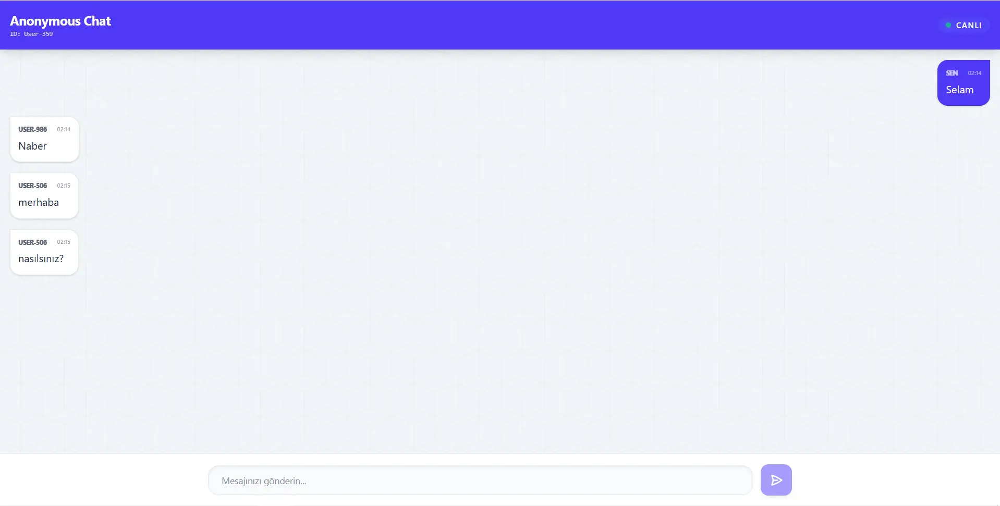

# Anonymous-Chat-App

React • Tailwind CSS v4 • GraphQL • Node.js (Express) • Redis • Docker App

---



---

Bu proje, modern web teknolojilerini kullanarak geliştirilmiş, tamamen gerçek zamanlı ve anonim bir sohbet uygulamasıdır. Kullanıcılar herhangi bir kayıt işlemi gerekmeden rastgele kimliklerle anlık olarak mesajlaşabilirler.

## 🚀 Özellikler

- **Gerçek Zamanlı İletişim:** GraphQL Subscriptions ve WebSocket protokolü ile mesajlar anında iletilir.
- **Anonim Kimlikler:** Her kullanıcıya oturum bazlı rastgele bir ID (örn: User-432) atanır.
- **Modern Arayüz:** Tailwind CSS v4 kullanılarak geliştirilmiş, tamamen responsive ve şık tasarım.
- **Pub/Sub Altyapısı:** Mesaj trafiği Redis PubSub ile yönetilir, bu da uygulamanın ölçeklenebilir olmasını sağlar.
- **Docker Entegrasyonu:** Redis veritabanı Docker konteynırı üzerinde izole bir şekilde çalışır.

## 🛠️ Teknoloji Yığını

- **Frontend:** React (Vite), Apollo Client
- **Styling:** Tailwind CSS v4
- **Backend:** Node.js, Express, Apollo Server
- **Protokol:** GraphQL (Mutation & Subscription), `graphql-ws`
- **Veri Akışı:** Redis PubSub
- **Ortam:** Docker

## 📋 Gereksinimler

Projenin yerel makinenizde çalışması için aşağıdaki araçların yüklü olması gerekir:

- Node.js (v18+)
- Docker Desktop
- npm veya yarn

## 🔧 Kurulum ve Çalıştırma

### 1. Redis'i Docker Üzerinde Başlatın

```bash
docker run --name chat-redis-final -p 7379:6379 -d redis
```

---

This project is a fully real-time and anonymous chat application built with modern web technologies. Users can communicate instantly using random session-based identities without any registration required.

## 🚀 Features

- **Real-Time Communication:** Instant message delivery powered by GraphQL Subscriptions and the WebSocket protocol.
- **Anonymous Identities:** Each user is assigned a random session-based ID (e.g., User-432) upon arrival.
- **Modern Interface:** A sleek, fully responsive design developed with the latest Tailwind CSS v4 engine.
- **Pub/Sub Infrastructure:** Message orchestration is managed via Redis PubSub, ensuring the system is scalable and performant.
- **Docker Integration:** The Redis database runs in an isolated environment using Docker containers for consistency.

## 🛠️ Tech Stack

- **Frontend:** React (Vite), Apollo Client
- **Styling:** Tailwind CSS v4
- **Backend:** Node.js, Express, Apollo Server
- **Protocols:** GraphQL (Mutation & Subscription), `graphql-ws`
- **Data Flow:** Redis PubSub
- **DevOps:** Docker

## 📋 Requirements

To run this project locally, you need to have the following installed:

- Node.js (v18 or higher)
- Docker Desktop
- npm or yarn

## 🔧 Installation and Setup

### 1. Start Redis via Docker

The application requires Redis for real-time message distribution. Run the following command to start a Redis container:

```bash
docker run --name chat-redis-final -p 7379:6379 -d redis
```

[Patika GraphQL Project-3](https://academy.patika.dev/courses/graphql/project-03)

[Patika](https://academy.patika.dev/tr/@alpk)
